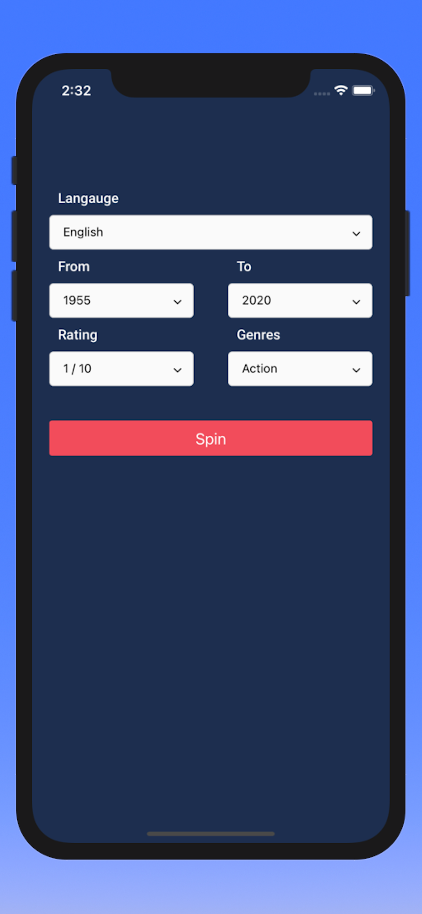
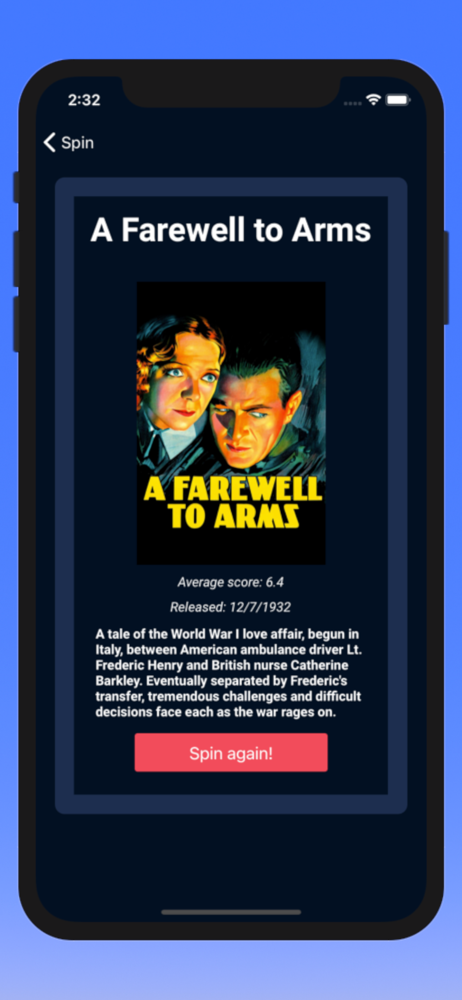

# Movie Roulette

Movie Roulette is a great tool to use when you can't figure out which movie to watch. Using a simple interface, you can enter parameters for a movie you'd like to see and "Spin" the movie roulette wheel. I have definitely found some hidden gems (along with hidden not-so-gems) while creating this app.

All you have to do is enter a set of parameters and hit "spin"!

### The Spin page

  

### The results page

  

Movie Roulette was built with [React Native](https://reactnative.dev/) and is powered by [The Movie Database](https://www.themoviedb.org/) API.

## Installation instructions

To install Movie Roulette, first make sure that you have the `yarn` and `npm` package managers installed on your machine along with `Expo CLI`.

You can install yarn via homebrew by running the following command:

`brew install yarn`

Instructions for installing npm can be found [here](https://www.npmjs.com/get-npm).

You can install expo following command in your shell:

`$ npm install --global expo`

If you are having any issues installing the above packages, you can find more detailed installation instructions for `yarn` [here](https://classic.yarnpkg.com/en/docs/install) and `Expo CLI` [here](https://docs.expo.io/get-started/installation/)

Once you have downloaded a zip of the repository, make sure you are in the parent directory and run:

`yarn install`

Once all dependencies are downloaded, run the command:

`yarn start`

This will open expo developer tools in your default browser. From there, you can run the application in the iOS simulator by clicking on `Run on IOS simulator`. Please note that this build is optimized for iOS and not optimized for Android..
